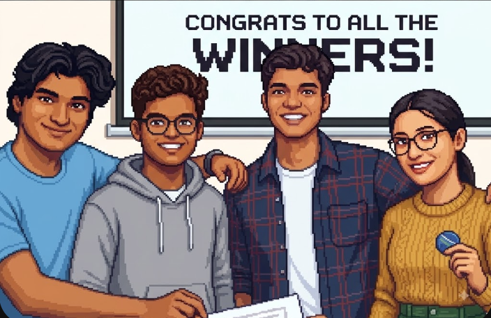
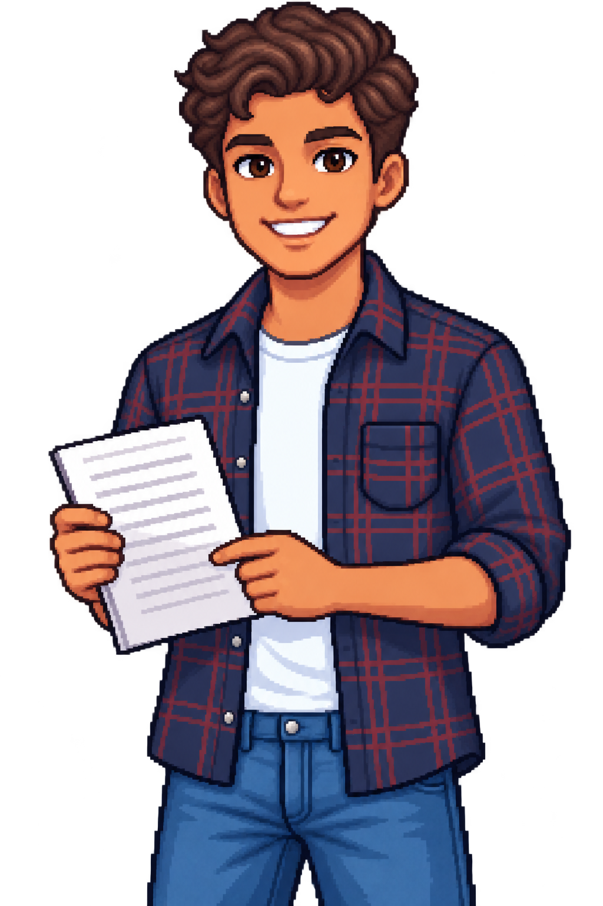
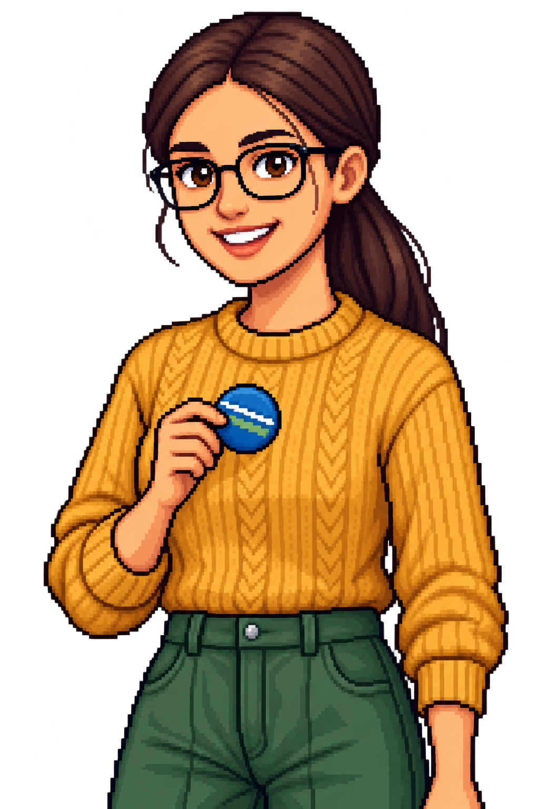
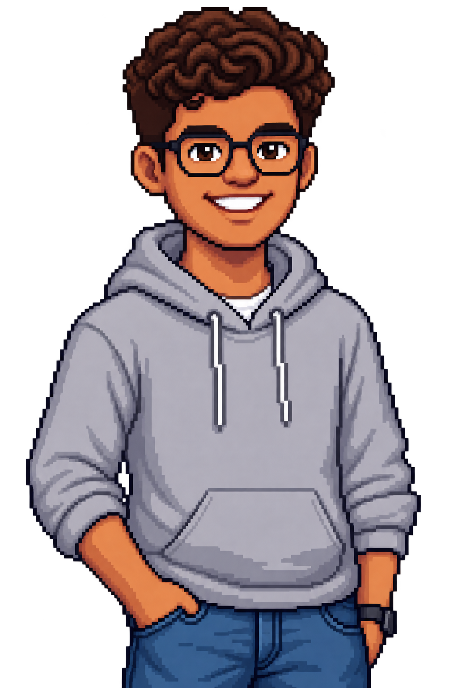

<!-- Animated gradient wordmark. Regenerate with tools/make_title.py if the name changes. -->

Welcome to **CodedbyAKSA**. We are a party of four developers embarking on epic quests across the codebase, battling bugs, and force-pushing our way to victory.

 

<h2 align="center">🕹️ CHARACTER SELECT 🕹️</h2>

<table align="center" style="border: none;">
  <tr>
    <td width="50%">
      
      <h3><code>Karthik Janardhan</code></h3>
      <b>Class:</b> Fullstack & GenAI Dev 
      
      
       
       <i>Fullstack developer and AI/ML & GenAI explorer.</i>
    </td>
    <td width="50%" align="right">
      
      <h3><code>Anushka Kotal</code></h3>
      <b>Class:</b> Web Developer & Designer 
      
       
       <i>Web developer and project builder crafting clean, user-friendly designs.</i>
    </td>
  </tr>
  <tr>
    <td width="50%">
      
      <h3><code>Stash Lopes</code></h3>
      <b>Class:</b> AI, Web & Systems Dev 
      
      
       
       <i>Engineer in progress, building projects across AI, web, and systems.</i>
    </td>
    <td width="50%" align="right">
      
      <h3><code>Ashwin Koonissery</code></h3>
      <b>Class:</b> AI Engineer & Software Dev 
      
      
       
       <i>AI engineer passionate about Generative AI and real-world intelligent solutions.</i>
    </td>
  </tr>
</table>

 

---

<b>⚔️ Four developers. One codebase. Zero merge conflicts (eventually). ⚔️</b>

